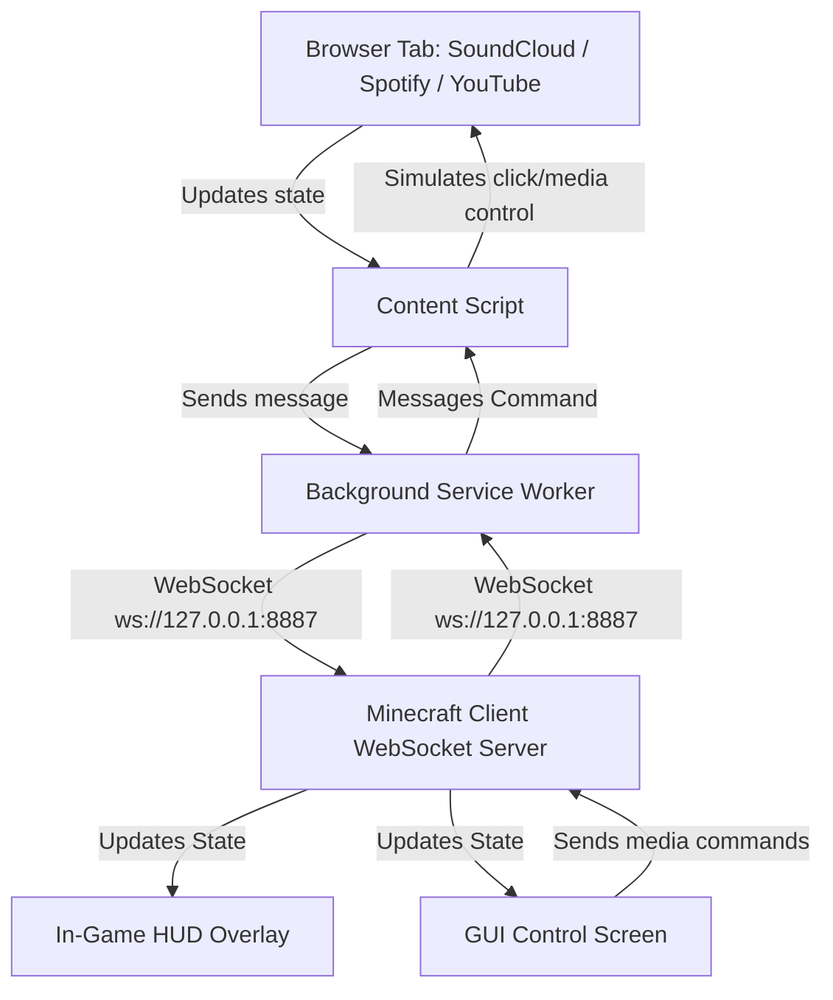

# SoundCraft

<p align="left">
  
  
  
</p>

**SoundCraft** is a Minecraft Fabric mod that brings real-time music synchronization directly into your game. With the help of a lightweight companion browser extension, it captures music metadata (track title, artist, cover art, and playback state) from platforms like **SoundCloud**, **Spotify**, and **YouTube**, and displays it in a beautiful, dynamic HUD or interactive overlay inside Minecraft. You can even control playback using keybinds or an in-game GUI!

---

## 🚀 Features

*   **Real-Time Synchronization**: Syncs currently playing track title, artist, artwork cover URL, play/pause state, and progress.
*   **Multi-Platform Support**: Seamlessly captures track updates from **SoundCloud**, **Spotify**, and **YouTube** web players.
*   **Stunning In-Game HUD**: Displays a clean, elegant HUD with the track title, artist, cover art, and a progress bar that dynamically colors itself to match the dominant color of the cover art!
*   **Interactive Control Panel**: Open an in-game control screen (default: `J`) featuring premium glassmorphism styling, a seekable progress bar, and media buttons (⏮ Prev, ⏯ Play/Pause, ⏭ Next).
*   **Direct Media Hotkeys**: Control your browser music without leaving the game window or ALT-TABbing.
*   **Lightweight Communication**: Connects local clients securely using a lightweight, local WebSocket server (port `8887`).

---

## 🎮 Keybindings

Use the following default hotkeys while in-game (un-focused):

| Action | Default Key | Description |
| :--- | :--- | :--- |
| **Open Control Panel** | `J` | Opens the Glassmorphism controller GUI. |
| **Play / Pause** | `Numpad 5` | Toggles playback in your browser tab. |
| **Next Track** | `Numpad 6` | Skips to the next track. |
| **Previous Track** | `Numpad 4` | Plays the previous track. |

---

## 📥 Installation & Setup

Choose one of the methods below to install SoundCraft:

### 📦 Download Pre-compiled Releases

Get the latest build files directly:

<p align="left">
  <a href="https://github.com/Huyphan68080/Mod-SoundCraft/releases/latest">
    
  </a>
  &nbsp;&nbsp;
  <a href="https://github.com/Huyphan68080/Mod-SoundCraft/releases/latest">
    
  </a>
</p>

#### 1. Fabric Mod Installation
1. Download the Minecraft Mod `.jar` file using the button above.
2. Copy the `.jar` file into your `.minecraft/mods/` folder.
3. Start Minecraft with Fabric Loader 0.16.0+ on Minecraft 1.21.1.

#### 2. Browser Extension Installation
*   **Method A (Fastest)**:
    1. Download the Browser Extension `.zip` using the button above and extract it.
    2. Open your browser and navigate to `chrome://extensions/`.
    3. Enable **Developer mode** (top-right corner).
    4. Click **Load unpacked** (top-left corner) and select the extracted folder.
*   **Method B (From Cloned Repository)**:
    1. Open your browser and navigate to `chrome://extensions/`.
    2. Enable **Developer mode** (top-right corner).
    3. Click **Load unpacked** and select the `extension` folder inside this cloned repository.

---

### 🛠️ Build from Source (For Developers)

<details>
<summary>Click to view compile instructions</summary>

#### Requirements
*   Java 17 or higher
*   Gradle (provided via wrapper)

#### Compiling
1. Clone this repository:
   ```bash
   git clone https://github.com/Huyphan68080/Mod-SoundCraft.git
   cd Mod-SoundCraft
   ```
2. Build the project using Gradle:
   *   **Windows**: `.\gradlew build`
   *   **Linux/macOS**: `./gradlew build`
3. The compiled `.jar` file will be generated at `build/libs/soundcraft-1.0.0.jar`. Copy it to your `.minecraft/mods/` folder.

</details>

---

## 🛠 How It Works (Architecture)



---

## ⚙️ Configuration & Ports

*   The mod hosts a local WebSocket server listening on port **`8887`** (`ws://127.0.0.1:8887`).
*   Ensure that no other application is using port `8887` when starting Minecraft.
*   The browser extension will dynamically try to reconnect to Minecraft if the connection is lost.

---

## 📄 License

This project is licensed under the MIT License - see the [LICENSE](LICENSE) file for details.
