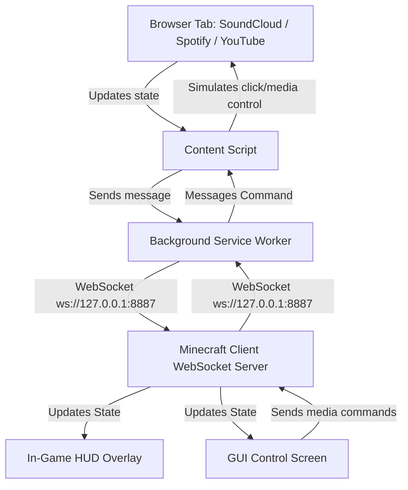

# SoundCraft

<p align="center">
  
  
  
</p>

**SoundCraft** is a Minecraft Fabric mod that brings real-time music synchronization directly into your game. With the help of a lightweight companion browser extension, it captures music metadata (track title, artist, cover art, and playback state) from platforms like **SoundCloud**, **Spotify**, and **YouTube**, and displays it in a beautiful, dynamic HUD or interactive overlay inside Minecraft. You can even control playback using keybinds or an in-game GUI!

---

## 📦 Downloads

You can download the pre-compiled files directly from the [GitHub Releases Page](https://github.com/Huyphan68080/Mod-SoundCraft/releases):

*   **Minecraft Mod**: Download `soundcraft-1.0.0.jar` and place it in your `.minecraft/mods/` folder.
*   **Browser Extension**: Download the `soundcraft-extension.zip` file, extract it, and load it in Chrome via **Load unpacked**.

---

## 🚀 Features

*   **Real-Time Synchronization**: Syncs currently playing track title, artist, artwork cover URL, play/pause state, and progress.
*   **Multi-Platform Support**: Seamlessly captures track updates from **SoundCloud**, **Spotify**, and **YouTube** web players.
*   **Stunning In-Game HUD**: Displays a clean, elegant HUD with the track title, artist, cover art, and a progress bar that dynamically colors itself to match the dominant color of the cover art!
*   **Interactive Control Panel**: Open an in-game control screen (default: `J`) featuring premium glassmorphism styling, a seekable progress bar, and media buttons (⏮ Prev, ⏯ Play/Pause, ⏭ Next).
*   **Direct Media Hotkeys**: Control your browser music without leaving the game window or ALT-TABbing.
*   **Lightweight Communication**: Connects local clients securely using a lightweight, local WebSocket server (port `8887`).

---

## 🎮 Keybindings

Use the following default hotkeys while in-game (un-focused):

| Action | Default Key | Description |
| :--- | :--- | :--- |
| **Open Control Panel** | `J` | Opens the Glassmorphism controller GUI. |
| **Play / Pause** | `Numpad 5` | Toggles playback in your browser tab. |
| **Next Track** | `Numpad 6` | Skips to the next track. |
| **Previous Track** | `Numpad 4` | Plays the previous track. |

---

## 🛠 How It Works (Architecture)



---

## 📥 Installation

Setting up SoundCraft requires two steps: installing the **Fabric Mod** and installing the **Browser Extension**.

### 1. Fabric Mod Setup

#### Requirements
*   Java 17 or higher
*   Minecraft 1.21.1 (Fabric loader >= 0.16.0)

#### Compiling from Source
1. Clone this repository to your local machine:
   ```bash
   git clone https://github.com/YOUR_USERNAME/SoundCraft.git
   cd SoundCraft
   ```
2. Build the mod using Gradle:
   *   **Windows (PowerShell/CMD)**:
       ```cmd
       .\gradlew build
       ```
   *   **Linux/macOS**:
       ```bash
       ./gradlew build
       ```
3. Locate the compiled `.jar` file under `build/libs/soundcraft-1.0.0.jar`.
4. Copy this jar file into your Minecraft `.minecraft/mods/` folder.

---

### 2. Browser Extension Setup

To capture music from SoundCloud, Spotify, or YouTube, install the unpacked Chrome extension:

1. Open your Chromium-based browser (Chrome, Edge, Brave, Opera).
2. Navigate to `chrome://extensions/`.
3. Enable **Developer mode** using the toggle switch in the top-right corner.
4. Click the **Load unpacked** button in the top-left corner.
5. Select the **`extension`** folder from the root of this cloned project.
6. The extension is now active! It will automatically attempt to connect to Minecraft whenever a compatible tab is open.

---

## ⚙️ Configuration & Ports

*   The mod hosts a local WebSocket server listening on port **`8887`** (`ws://127.0.0.1:8887`).
*   Ensure that no other application is using port `8887` when starting Minecraft.
*   The browser extension will dynamically try to reconnect to Minecraft if the connection is lost.

---

## 📄 License

This project is licensed under the MIT License - see the [LICENSE](LICENSE) file for details.
