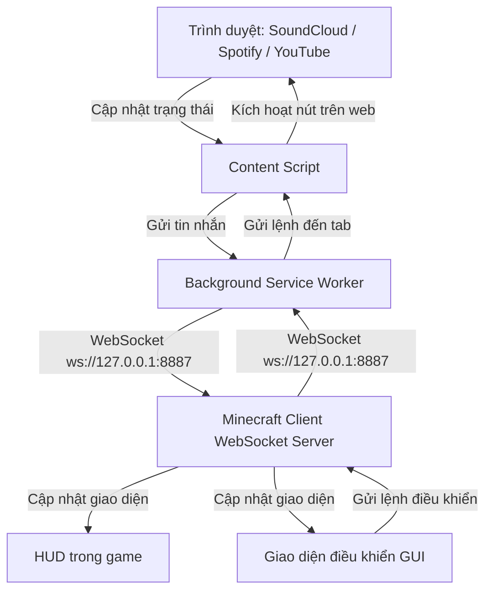

# SoundCraft

<p align="center">
  
  
  
</p>

**SoundCraft** là một mod Fabric dành cho Minecraft giúp đồng bộ hóa nhạc thời gian thực trực tiếp vào game của bạn. Với sự hỗ trợ của một tiện ích mở rộng trình duyệt (extension) nhẹ đi kèm, mod có thể ghi nhận thông tin bài hát (tên bài, nghệ sĩ, ảnh bìa album, trạng thái phát nhạc) từ các nền tảng như **SoundCloud**, **Spotify**, và **YouTube**, sau đó hiển thị trên giao diện HUD đẹp mắt hoặc bảng điều khiển tương tác trong game. Bạn thậm chí có thể điều khiển trình phát nhạc bằng phím tắt hoặc giao diện GUI trong Minecraft!

---

## 🚀 Tính năng nổi bật

*   **Đồng bộ hóa thời gian thực**: Đồng bộ hóa tên bài hát, nghệ sĩ, URL ảnh bìa, trạng thái phát/tạm dừng và tiến trình phát nhạc (progress).
*   **Hỗ trợ đa nền tảng**: Tự động nhận diện và đồng bộ từ các trình phát web của **SoundCloud**, **Spotify** và **YouTube**.
*   **Giao diện HUD đẹp mắt**: Hiển thị HUD sắc nét trong game với tên bài hát, nghệ sĩ, ảnh bìa và thanh tiến trình phát nhạc tự động đổi màu theo màu chủ đạo của ảnh bìa!
*   **Bảng điều khiển tương tác**: Mở màn hình điều khiển trong game (phím mặc định: `J`) với phong cách kính mờ (glassmorphism) hiện đại, thanh tiến trình trực quan và các nút điều khiển nhạc (⏮ Trước, ⏯ Phát/Tạm dừng, ⏭ Kế tiếp).
*   **Phím tắt điều khiển trực tiếp**: Điều khiển nhạc trên trình duyệt mà không cần phải thoát Minecraft hoặc dùng tổ hợp phím ALT-TAB.
*   **Kết nối gọn nhẹ**: Kết nối các client cục bộ một cách an toàn thông qua một WebSocket Server cục bộ chạy trên cổng `8887`.

---

## 🎮 Hệ thống phím tắt

Sử dụng các phím tắt mặc định sau khi đang ở trong trò chơi (không mở giao diện chat/khác):

| Hành động | Phím mặc định | Mô tả |
| :--- | :--- | :--- |
| **Mở bảng điều khiển** | `J` | Mở giao diện điều khiển (Controller GUI) phong cách kính mờ. |
| **Phát / Tạm dừng** | `Numpad 5` (Phím số 5) | Bật/tắt phát nhạc trên trình duyệt. |
| **Bài tiếp theo** | `Numpad 6` (Phím số 6) | Chuyển sang bài tiếp theo. |
| **Bài trước đó** | `Numpad 4` (Phím số 4) | Quay lại bài trước đó. |

---

## 🛠 Nguyên lý hoạt động (Kiến trúc)



---

## 📥 Hướng dẫn cài đặt

Để thiết lập SoundCraft, bạn cần thực hiện 2 bước: cài đặt **Fabric Mod** trong Minecraft và cài đặt **Browser Extension** trên trình duyệt.

### 1. Cài đặt Fabric Mod

#### Yêu cầu hệ thống
*   Java 17 trở lên
*   Minecraft 1.21.1 (Fabric loader >= 0.16.0)

#### Biên dịch từ mã nguồn (Compile)
1. Clone mã nguồn của repository này về máy của bạn:
   ```bash
   git clone https://github.com/YOUR_USERNAME/SoundCraft.git
   cd SoundCraft
   ```
2. Build mod bằng Gradle:
   *   **Windows (PowerShell/CMD)**:
       ```cmd
       .\gradlew build
       ```
   *   **Linux/macOS**:
       ```bash
       ./gradlew build
       ```
3. Tìm file `.jar` đã biên dịch tại đường dẫn `build/libs/soundcraft-1.0.0.jar`.
4. Copy file jar này vào thư mục mod của Minecraft tại `.minecraft/mods/`.

---

### 2. Cài đặt Browser Extension

Để nhận nhạc từ trình duyệt, hãy cài đặt extension Chrome dưới dạng unpack:

1. Mở trình duyệt Chromium (Chrome, Edge, Brave, CocCoc, Opera).
2. Truy cập địa chỉ `chrome://extensions/`.
3. Bật **Chế độ dành cho nhà phát triển** (Developer mode) ở góc trên bên phải màn hình.
4. Nhấn nút **Tải thư mục đã giải nén** (Load unpacked) ở góc trên bên trái.
5. Chọn thư mục **`extension`** nằm ở thư mục gốc của dự án này.
6. Extension đã sẵn sàng hoạt động! Nó sẽ tự động kết nối đến Minecraft mỗi khi bạn nghe nhạc trên các trang web được hỗ trợ.

---

## ⚙️ Cấu hình & Cổng mạng

*   Mod khởi chạy một WebSocket server nội bộ lắng nghe tại cổng **`8887`** (`ws://127.0.0.1:8887`).
*   Hãy đảm bảo không có ứng dụng nào khác sử dụng cổng `8887` trước khi mở game Minecraft.
*   Extension trình duyệt sẽ tự động thử kết nối lại với Minecraft nếu kết nối bị gián đoạn.

---

## 📄 Giấy phép

Dự án này được phát hành dưới giấy phép MIT License - xem file [LICENSE](LICENSE) để biết thêm chi tiết.
